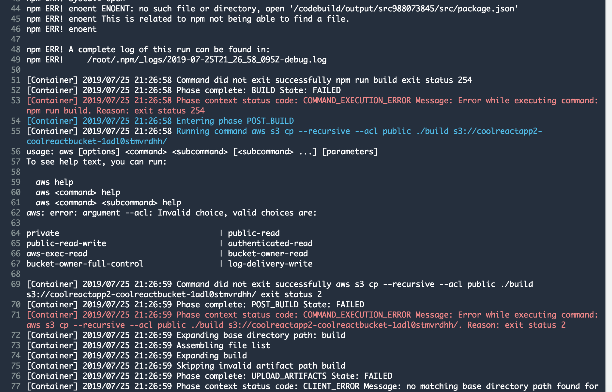

# Fixing AWS Cloudformation Templates

## Template 1

#### Errors

- "cool-react-bucket" was not formatted properly. The dashes were not allowed.

- One of the parameters on the yaml file, specifically "GithubOAuthToken" was not indented properly causing the above errors. 

## Template 2

#### Errors

- one of the commands was given a private permission parameter instead of 'public'

